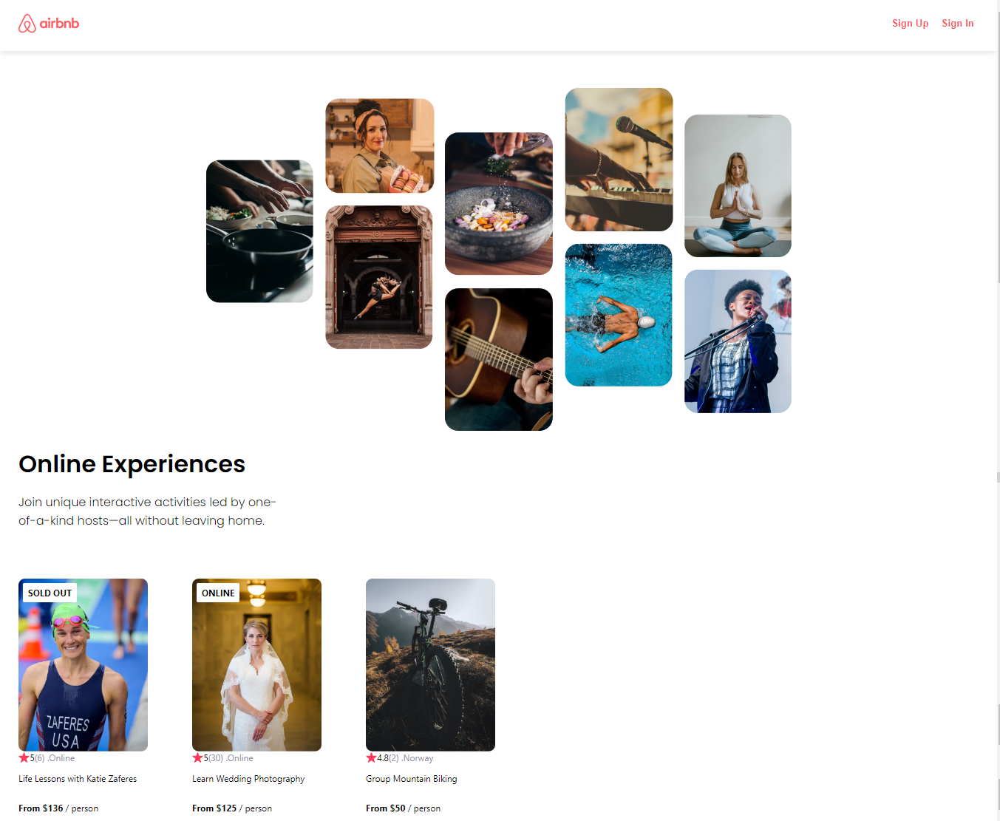

<h2>About the project</h2>

  
A <b>Airbnb</b> is website will be an activity finder that allows users to search for and book activities in their area. The website will be built using React, a popular JavaScript framework.

<h5>Features:</h5>
<ul>
  <li>The website will have a clean and modern design.</li>
  <li>The website will be responsive, meaning it will look good on all devices, including desktops, laptops, tablets, and smartphones.</li>
  <li>The website will use React, a popular JavaScript framework that makes it easy to create interactive and dynamic websites.</li>
  <li>The website will allow users to view menus for restaurants.</li>
  <li>The website will allow users to make reservations at restaurants.</li>
</ul>

👉 Live Demo: <a href='https://airbnb-elsa33eed.vercel.app/' target="_blank">Live Demo</a>

<h3>Build with:</h3>

» React  
» CSS  

<h2>Screenshots of the Project 📸</h2>
 
<h3 align='center'>Home Page 🏡</h3>

